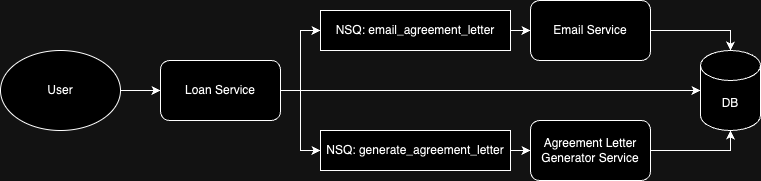
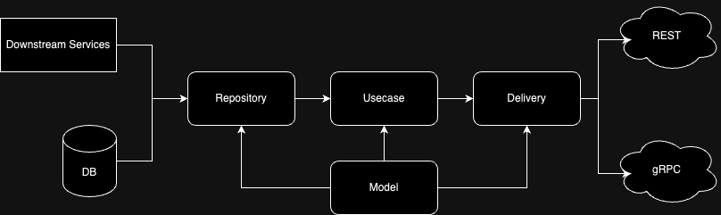

## Example 3: Loan Service (System Design & Abstraction)

The solution I propose is an MVP, focusing on developing the program for the main service where most of the logic for this solution resides.

### 1. System Design
Here, I propose several services to fulfill the requirements of the Loan Service:
- **loan-service**: Contains the core logic of the solution.
- **agreement-letter-generator-service**: Responsible for generating the agreement letter for the borrower.
- **email-service**: Responsible for sending an email containing a link to the agreement letter.



### 2. List of APIs
- **Endpoints:**

    ```
    POST /loans
        - Create a new loan (transition to proposed state).

    GET /loans
        - Retrieve loans.

    GET /loans/{loan_id}
        - Retrieve details of a specific loan.

    POST /loans/{loan_id}/approve
        - Transition loan to approved state.

    POST /loans/{loan_id}/invest
        - Record investment details (transition to invested state when conditions are met).

    POST /loans/{loan_id}/disburse
        - Disburse the loan (transition to disbursed state).

    GET /admin/view/loans
        - Retrieve full information of all loans. For admin or debugging purposes only.
    ```

- **Request/Response Examples:**

    **Creating a Loan:**
    ```json
    POST /loans
    {
        "borrower_id": 1,
        "principal_amount": 100000,
        "rate": 5,
        "roi": 7.5
    }
    ```

    **Approving a Loan:**
    ```json
    POST /loans/{loan_id}/approve
    {
        "picture_proof_url": "https://example.com/picture_proof.jpg",
        "field_validator_id": 1
    }
    ```

    **Investing in a Loan:**
    ```json
    POST /loans/{loan_id}/invest
    {
        "investor_id": 1,
        "invested_amount": 50000
    }
    ```

    **Disbursing a Loan:**
    ```json
    POST /loans/{loan_id}/disburse
    {
        "agreement_letter_url": "https://example.com/agreement_letter.pdf",
        "field_officer_id": 1
    }
    ```

### 3. System Flow Assumptions
- **State 1: Proposed State**
    The user here is the borrower. They use the `POST /loans` API to create a new loan. In this stage, we also generate the agreement letter that will eventually be signed by the borrower. I assume the letter can be generated at this stage because no subsequent process mutates the letter. This letter will be sent to investors for each investment they make.

- **State 2: Approved State**
    In this state, the field validator will approve the loan using the `POST /loans/{loan_id}/approve` API, with validations such as ensuring the loan is in the Proposed State and fulfilling the fields: `picture_proof_url` and `field_validator_id`.

- **State 3: Invested State**
    In this state, the total invested amount equals the loan principal. Investors will call `GET /loans` to see all loans, `GET /loans/{loan_id}` to get detailed information about a loan, and then hit the `POST /loans/{loan_id}/invest` API to invest.

- **State 4: Disbursed State**
    After the invested amount reaches the loan principal, the field officer will hand over the money, collect the signed agreement letter, and call the `POST /loans/{loan_id}/disburse` API.

### 4. Code Architecture
In this repository, I use clean architecture, which consists of four layers:
- **Model Layer**: Responsible for holding the contract or data type.
- **Repository Layer**: Responsible for getting data from the downstream.
- **Use Case Layer**: Contains the business logic.
- **Delivery Layer**: Responsible for converting the request or response data from the handler (e.g., REST or gRPC) to the layer below.

In this architecture, I also use interfaces for each layer, so we can easily create mock requests and responses for unit tests.



I also created some wrappers for each driver so we can add custom logic inside them. The benefits of this approach are:
- We only need to code in one place.
- We can create a mock driver for unit tests.
- We can easily customize the driver as needed.
